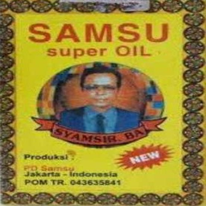
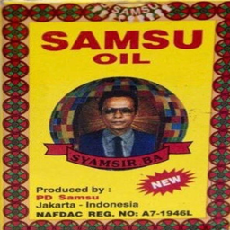

 # SafeMed
  This is a android app to prevent users from using counterfiet medcines and also prevent users from contacting fake dealers for essentials.

## Description
  ### Problem Statement

  In the present time, essentials like viral drugs, oxygen contrators etc. are in very high demand.There is shortage of these essentias in legal market because of less production in comparison to demand. So, desparate families of covid patients are approaching black market to buy the above mentioned essentials.Buying essentials from these market can cause major problems:

  1. Buyer can get a counterfiet medicine.
  2. Buyer can get a medicine of brand that are not approved by government(Fake Medicines).
  3. Buyer can be duped by a dealer by making fake promises of providing essentials.

  ### Proposed Solution

  #### Problem 1 and Problem 2 Solution

  #### Idea

  We have observed that counterfiet medicines have some dissimilarities in their packaging style as comapred original medicine packet.For example, gaping between letters , colour sharpnes , thickness of letters etc.These differences are so minimal that it is not observable to buyer. While in fake medicines these differences are observable but buyer buys these medicines because of less awareness about approved medicines of particular type(type here refrencing to generic name).

  So we are proposing an idea to differentiate between original medicines of approved brand names and fake or counterfiet medicines by detecting the differences between their packaging using Deep Learning.

  #### Idea Implementation
  To detect these dissimilarities between original and counterfiet or fake medicine packaging, we have introduced a deeplearning model based on siamese network.The models encodes a image into a vector of 256 elements.The model is trained in such a way that euclidean distance between encodings of images of same type of pakcaging  is very less while between images of different type of packaging is large.
  On experementation we have observed that distance between image of same packaging is around less than 0.3 at an average.So, we have set **0.3** as threshold for our verification of medicines.
  
  ##### Training of Model

  We have used 180 different classes of for training and 19 classes for validation.

  1. We have obtained the dataset thorough google images.
        
  2. One image per class has been obtained through google.
        
  3. Dataset includes such images  that for each image, there are  images in dataset that looks very similar to it but have different class which was useful for making model train hard.
  
  Example of training data(both images are of different classes):
  
  
  
  
   [Link of Training Data](https://drive.google.com/drive/folders/1wXMFgge4Ec_Bn2RCr2tcqV-xc4VrJ7pR?usp=sharing)
   
  4. Image per classes is made 30 by using data augmentation.Augmentation operation includes changing brightness,shear,rotation,  shifting.Images are augmented very slightly in such a way that they look like real image with some changes occured during taking their images though camera in general.
        
  5. Augmenation is not applied on validation data.
        
  6. We have used Google **Xception** pretrained model trained on Imagenet Dataset.
        
  7. SemiHardTriplet Loss is used as a metric for optimization during training of model.
        
    
  8. Result with above mentioned dataset:
     * *Highest Training Accuracy Obtained* - 82%
     * *Highest Validation Accuracy Obtained* - 80%
         
 
#### Impoartan Features of our model:
  One-Shot Learning : Our model is able to classify the similar image and dissimilar image of new classes correctly.
  
  Flexibility : Our model is invariant to changes in light, and slight rotation.
  
  Explanantion of solution through an example:
  
  Remdesevir is manufactured by two approved brands of India.These companies sell remdesevir in three different types packages.
  Now if a user input an image of packet of a remdesivir drug.Our application will find embedding of this image,will calculate the distance between the embedding of user image and original images of approved brands.
  There can be three scenerios:
  
  1.If user medcine is fake:
    We found that in such cases all the distances are greater than threshold by large margin.
    
  2.If user medicine is Counterfiet:
    We found that in such cases all the distances are greater than threshold with not so very small margin.
  
  3.If user image is Genuine:
    We found that in such cases at least one of the distance is less than threshold .
    
### To load and test our model go to [Fake-Medicine-Detector repository](https://github.com/Sauravpandey98/Fake-Medicine-Detector) .

### Solution of 3rd Problem:

#### Idea

We observed that people generally post the information about fake dealer on twitter and some other website that collects such data to aware other people to not to approach them. So, our idea is to access data from such websites and providing the facility of verifying the dealer by searching using phone number or UPI of the dealer as input.

#### Idea Implementation
We are accessing the database of below mentioned website using API.

 [Website Link](https://cov.social/#/) 
 
 This website is a volunteer driven intiative where a person can post the information of a fake dealer along with the fake promises that the dealer is making to dupe a person.
 
 We are accessing the data and using filters in java we are providing the facility to user to verify the dealer.
 ## Process Flow Diagram
 [Process flow of system](https://embed.creately.com/IraYDEStVeW?type=svg)
 
 ## DFD
 
        
        
         
         
         
        
        
        
